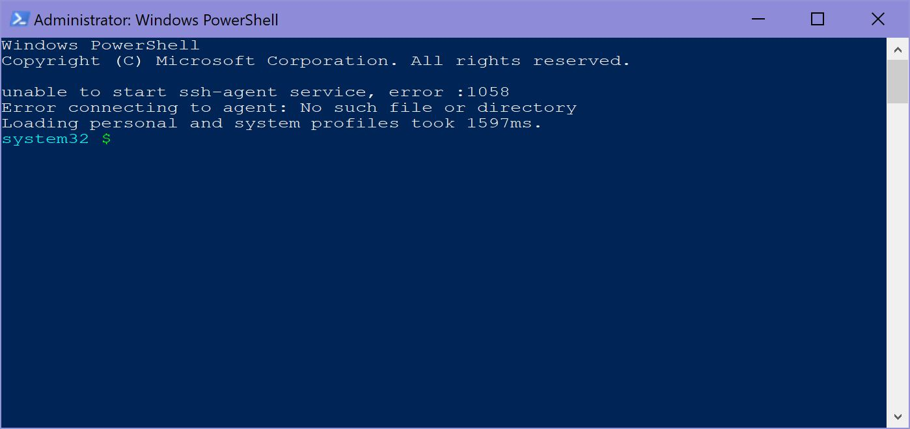

# So you want to web dev on Windows

Anyone ever told you you can't be a _real_ web developer on a PC? Maybe you want to get started but feel gimped by the price of a Macbook? Maybe you are already a gamer, have a sweet rig and don't want to buy a separate computer?

Windows Subsystem Linux (WSL) to the rescue!

Just want the steps? [Skip to the end](#just-the-steps)

## Assumptions

- Windows 10 Fall Creators Update
- You can interact with your computer
- Sense of humor optional

## Installation

Microsoft keeps pretty good docs on enabling WSL on your own machine, reference them [here](https://docs.microsoft.com/en-us/windows/wsl/install-win10). Also check out this [HowToGeek](https://www.howtogeek.com/249966/how-to-install-and-use-the-linux-bash-shell-on-windows-10/) article that has a few extra tips.

Here's the quick and dirty for my setup.

### Step 1: Powershell

Open up Powershell as an administrator. If you've never done that, follow these instructions.

- Press the **Windows** key
- Type **Powershell**
- Right-click **Powershell**
- Select **Run as Administrator**
- Click **Yes** when prompted

You should see something like this (ignore the `ssh` stuff there, I'll figure that out later...)



Once you have an administrator-powered Powershell terminal open, paste the following command in and run it:

```shell
Enable-WindowsOptionalFeature -Online -FeatureName Microsoft-Windows-Subsystem-Linux
```

Congratulations, you're now a hacker!

### Step 2: Restart your computer

Restart it, and get used to that being the solution to a few of your problems. Seriously, if things just don't seem to be working correctly, go ahead and reboot. 👍

### Step 3: Pick your Linux distribution

I've been using Ubuntu 16.04 LTS and recently had success upgrading to 18.04 LTS. This guide doesn't cover the upgrade process, so pick either `16.04` or `18.04` and let's roll 🚀.

Head on over to the Microsoft Store (hit that **Windows** key again and search for `Microsoft Store`, hit enter). Search for `Linux` or `Ubuntu`, and install one of them.

### Step 4: Create your user

Open Ubuntu by hitting that **Windows** key again and typing in `ubuntu`. You should be prompted to create a user. I believe a default `root` user is created that is automatically logged in when you open your `bash` terminal.

If you do decide to create a new you 💁, pick a one-word, all lower-case username and any password you will remember (or the same one you use for Windows).

### Step 5: Update Ubuntu

```shell
sudo apt update && sudo apt -y upgrade
```

The `-y` flag here auto affirms upgrades to the installation.

Hit enter and ☕️ or 🚶 or 😴

### Step 6: Install essential build tools

```shell
sudo apt install -y build-essential
```

These are essential for development, right?

### Step 7: Install `n, node, npm`

We will be using `n`, a robust and capable node version manager, via [n-install](https://github.com/mklement0/n-install). This will also install LTS versions of node and npm.

```shell
curl -L https://git.io/n-install | bash
```

restart the terminal and type `node -v && npm -v`, **smash** that enter key, and behold the node and npm versions.

### Step 8: Install `yarn` (optional)

I generally prefer `yarn`, even though `npm` has made some significant improvements in speed lately. However, the way they build dependencies is different and I more often have trouble with `npm`, so get `yarn`!

```shell
curl -sS https://dl.yarnpkg.com/debian/pubkey.gpg | sudo apt-key add -
echo "deb https://dl.yarnpkg.com/debian/ stable main" | sudo tee /etc/apt/sources.list.d/yarn.list
yarn -v
```

### Step 9: Next steps

Check out these other ways to make your dev experience better!

## Just the steps

- Open Powershell as Administrator
- Enable WSL

```shell
Enable-WindowsOptionalFeature -Online -FeatureName Microsoft-Windows-Subsystem-Linux
```

- Restart your computer
- Install [Ubuntu](https://www.microsoft.com/store/productId/9NBLGGH4MSV6)
- Open Ubuntu from the start menu
- Create a new user, or just hit enter a few times to be root
  - I'm not exactly sure of any consequences here
- Scripts 👇, do them

```shell
sudo apt update && sudo apt -y upgrade
# ... ☕️
# Get essential build tools
sudo apt install -y build-essential
# Get `n` via `n-install`
curl -L https://git.io/n-install | bash
# close and reopen ubuntu / bash
node -v && npm -v
# Should see versions
# Get `yarn`
curl -sS https://dl.yarnpkg.com/debian/pubkey.gpg | sudo apt-key add -
echo "deb https://dl.yarnpkg.com/debian/ stable main" | sudo tee /etc/apt/sources.list.d/yarn.list
yarn -v
```

🍕 🕡
