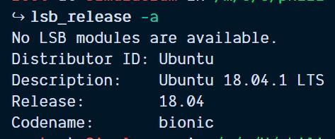

# WSL (Windows Subsystem Linux)

This is part one in the documentation of my dev setup. Major props go out to all the resources I've used to get to this point. This particular guide draws heavily from [Scott Spence's](https://github.com/spences10) lovely article [Automating your Windows Subsystem Linux Setup](https://medium.freecodecamp.org/automating-your-windows-subsystem-linux-setup-df4c9a7b0e7b)

So you do your web development on a PC and it's working just fine. You can run Node and NPM from your terminal and you're slinging JavaScript like a pro. But wait, why doesn't this work as expected? Oh, that's right, this isn't `bash`...

**Windows Subsystem Linux (WSL) to the rescue!**

Let's get set up to dev from our Windows machine.

Just want the steps? [Skip to the end](#just-the-steps)

## Assumptions

- Windows 10 Fall Creators Update or later
- Some basic terminal knowledge
- A sense of adventure

## Caveats

I've experienced some strange behavior when I've had multiple instances of certain packages. Unless you know how to link to the right `node` package from the `ubuntu bash` it's probably best to clean out `node/npm/yarn` from the Windows side of things. By the end of this, the only Windows apps you'll need to do any dev are GUIs like [VSCode](https://code.visualstudio.com/), [Git for Windows](https://git-scm.com/download/win), and maybe a DB GUI like [PG Admin](https://www.pgadmin.org/).

## Installation

Microsoft keeps pretty good docs on enabling WSL on your own machine, reference them [here](https://docs.microsoft.com/en-us/windows/wsl/install-win10). Also check out this [HowToGeek](https://www.howtogeek.com/249966/how-to-install-and-use-the-linux-bash-shell-on-windows-10/) article that has a few extra tips.

Here's the quick and dirty for my setup.

### Step 1: Powershell

Open up Powershell as an administrator. If you've never done that, follow these instructions.

- Press the **Windows** key
- Type **Powershell**
- Right-click **Windows Powershell**
- Select **Run as Administrator**
- Click **Yes** when prompted

Once you have an administrator-powered Powershell terminal open, paste the following command in and run it:

```bash
Enable-WindowsOptionalFeature -Online -FeatureName Microsoft-Windows-Subsystem-Linux
```

Congratulations, you're now a hacker!

### Step 2: Restart your computer

Restart it, and get used to that being the solution to a few of your problems. Seriously, if things just don't seem to be working correctly, go ahead and reboot. 👍

### Step 3: Pick your Linux distribution

I've been using Ubuntu 16.04 LTS and recently had success upgrading to 18.04 LTS. This guide doesn't cover the upgrade process, so pick either `16.04` or `18.04` and let's roll 🚀.

Head on over to the Microsoft Store (hit that **Windows** key again and search for `Microsoft Store`, hit enter). Search for `Linux` or `Ubuntu`, and install one of them.

### Step 4: Create your user

Open Ubuntu by hitting that **Windows** key again and typing in `ubuntu`. You should be prompted to create a user. I believe a default `root` user is created that is automatically logged in when you open your `bash` terminal.

If you do decide to create a new you 💁, pick a one-word, all lower-case username and any password you will remember (or the same one you use for Windows).

There is also a general `ubuntu` install available in the Microsoft Store, I'm not sure which version that installs. If you chose that route, you can find out what you have installed by typing `lsb_release -a` into your `bash` terminal after install. You should see something like this.



### Step 5: Update packages

```bash
sudo apt update && sudo apt -y upgrade
```

The `-y` flag here auto affirms upgrades to the installation. `sudo` is an indication that you are acting as the administrator in this shell. If you attached a password to your user you will have to enter it after each `sudo`, I believe.

Hit enter and ☕️ or 🚶 or 😴

### Step 6: Install essential build tools

```bash
sudo apt install -y build-essential
```

These are essential for development, right?

### Step 7: Install `n, node, npm`

We will be using `n`, a robust and capable node version manager, via [n-install](https://github.com/mklement0/n-install). This will also install LTS versions of node and npm.

To install any version of `node`, type `n <node_version>`, e.g. for version 9.6.1 I would type `n 9.6.1`. Typing `n` and hitting Enter will show you all your available node installs. Navigate with the up/down arrows and select one by hitting Enter.

```bash
curl -L https://git.io/n-install | bash
```

restart the terminal and type `node -v && npm -v`, **smash** that enter key, and behold the node and npm versions.

### Step 8: Install `yarn` (optional)

I generally prefer `yarn`, even though `npm` has made some significant improvements in speed lately. However, the way they build dependencies is different and I more often have trouble with `npm`, so get `yarn`!

```bash
curl -sS https://dl.yarnpkg.com/debian/pubkey.gpg | sudo apt-key add -
echo "deb https://dl.yarnpkg.com/debian/ stable main" | sudo tee /etc/apt/sources.list.d/yarn.list
yarn -v
```

### Step 9: Next steps

That's it for a basic setup. Install all your favorite packages in your WSL instance and have fun!

Check out these other topics to customize and streamline your new, WSL-powered dev experience.

- Terminal Emulator with [Hyper.js](https://hyper.is) and [Fish, the Friendly Interactive Shell](https://)

## Just the steps

- Open Powershell as Administrator
- Enable WSL

```bash
Enable-WindowsOptionalFeature -Online -FeatureName Microsoft-Windows-Subsystem-Linux
```

- Restart your computer
- Install [Ubuntu](https://www.microsoft.com/store/productId/9NBLGGH4MSV6)
- Open Ubuntu from the start menu
- Create a new user, or just hit enter a few times to be root
  - I'm not exactly sure of any consequences here
- Scripts 👇, do them

```bash
sudo apt update && sudo apt -y upgrade
# ... ☕️
# Get essential build tools
sudo apt install -y build-essential
# Get `n` via `n-install`
curl -L https://git.io/n-install | bash
# close and reopen ubuntu / bash
node -v && npm -v
# Should see versions
# Get `yarn`
curl -sS https://dl.yarnpkg.com/debian/pubkey.gpg | sudo apt-key add -
echo "deb https://dl.yarnpkg.com/debian/ stable main" | sudo tee /etc/apt/sources.list.d/yarn.list
yarn -v
```

🍕 🕡
